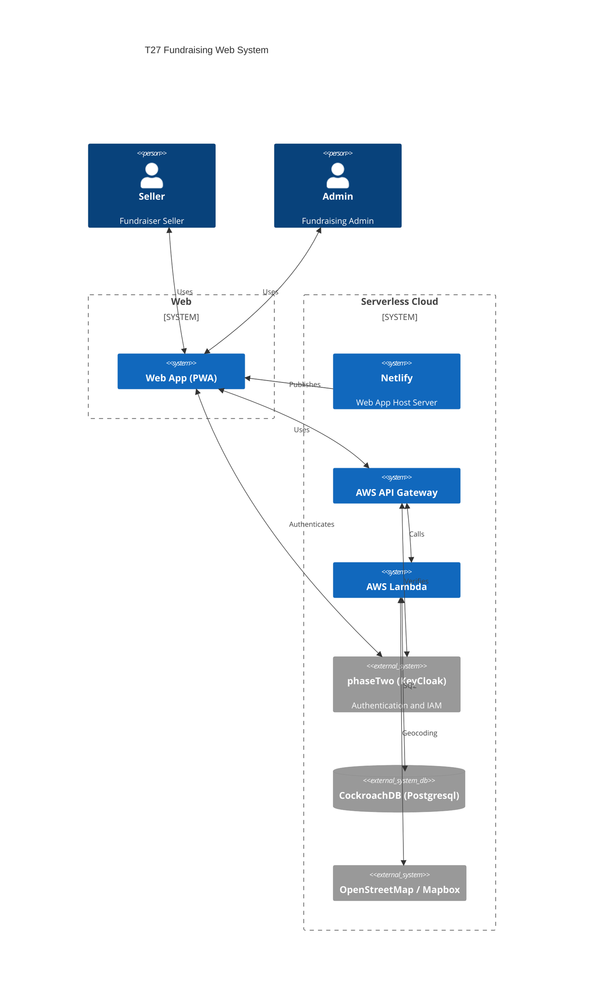

# Mulch Fundraiser SaaS System

## Original Goals

- Allow the Scouts of Troop 27 to enter in mulch sales
- The ability to enter orders from devices in the field and replace the paper
  system.
- Track the Scout time tracking for delivery
- Calculate financial information based on profits or other variables
- Utilize a modern serverless architecture with minimal cost and high
  reliability

## High Level Diagram

## Fundraising App (PWA)

From the beginning the concept for this new system was to be something the
Scouts could use from their devices to make sales. The decision was made to
create this app as a Progressive Web App (PWA) rather than create individual
mobile device apps. The other design goal was that this be a static web app so
that all the dynamic functionality happens in the browser. This eliminates the
need to have a server backend to dynamically generate the pages.

Main categories of functionality:

- User
  - Order Entry
  - User Summary/Standings
  - Mulch Spreading Status
  - Report generation capabilities
  - Order Area Saturation Heatmaps
- Admin Functionality
  - Adjust order for any user
  - Enter new orders for a user
  - Reset Fundraiser for a new year
  - Change Fundraiser Variables
  - Delivery workers time tracking
  - Allocation adjustment

### Why Rust

Having done web development for many years I have come to swear by Typescript
for large complex projects Originally the first iteration of this app was built
using Gatsby however while Gatsby supported Typescript it did not easily support
the type safety compilation and so maintenance was problematic and in general
the system was fragile as any medium complexity javascript project often can
become. There was also an expectation that it was easier for contributors to
pickup Javascript/Typescript. This turned out to not be true either.

To that end the 2nd version of this project was switched to the
[Yew Rust Framework](https://yew.rs/). This increased performance for app
compilation, performance in the client, true type validation, easier bug fixes
and feature additions. The tradeoff is as the app gained functionality load time
did increase. However not enough to be an issue. At some point when this does
get to be problematic then splitting up the app into different WASM modules will
solve this issue.

### Being served from Netlify

The current service hosting the static web app is [Netlify](https://www.netlify.com/).
Netlify was a great alternative to AWS Amplify.

Since this is a single page application (SPA) static hosting requirements is low.

Requirements are:

- TLS generation support
- Subdomain support
- API to allow publishing from build system

Using GitHub Actions a published release will trigger a new publishing operation
to the static host site.

## The Backend

### Authentication

Authentication is currently handled by [Phase//](https://phasetwo.io/)(aka
PhaseTwo). Phase// is a provider that bases their solution on
[KeyCloak](https://www.keycloak.org/).

There is also a Rust based AWS custom authenticator use by the API Gateway to
ensure JWT tokens in the API requests are valid.

Authentication has evolved since the original implementation. The original
version used AWS Cognito. The next year it moved to Okta's Auth0 service. This
was done to move towards an OAuth2 standard and move away from any vendor
specific lock-in. Upon discovering Keycloak and Phase// allowed this system to
become even more vendor neutral. This is due to Keycloak being offered by other
vendors with an option to spin it up on a compute instance as a last resort.

### AWS API Gateway

This services uses the AWS API Gateway with a custom authenticator. After
validation that the request is authentic, it is forwarded to a lambda for
further processing or direct pulls files from S3.

Rate limiting and other security measures has been enabled to reduce abuse and
costs.

### AWS Lambdas

#### API Lambda Handler

Written in Go, the API lambda processes the GraphQL query payload and gathers
the needed data from the SQL db and/or S3 files.

The first version was written in Python3. The switch to Go sped up times for
query return due to the use of a compiled language and a small executable size.

#### Geocoder Lambda Handler

Written in Go, the Geocoding lambda is triggered to run on a scheduled
increment. Its purpose is to take the addresses in any new orders that were made
since the last run, and do a geocode operation if that address is not in already
in our known addresses table. A GeoJSON file is then created in S3 that will be
returned whenever the operator asks for the sales heat map report.

### Database Backend

[CockroachDB](https://www.cockroachlabs.com/) is a cloud based database
solution. They have provided a PostgreSQL compatible interface that works well
with a PostgreSQL compatible driver.

The first version used AWS DynamoDB. As new features were requested it became
clear that this service would benefit from a SQL solution. Also DynamoDB was
another vendor lock-in to be avoided.

To further insulate the web interface from the backend data store, a GraphQL
based API interface was created.

## CLI Utility

A CLI tool written in Go was created as a tool to both debug the GraphQL APIs
and create local functionality not wanting to be exposed vis the web browser.
For security reasons we don't allow the web interface to create the
authentication accounts and so the CLI utility is the mechansim used to create
accounts based on a request made via the web browser.
